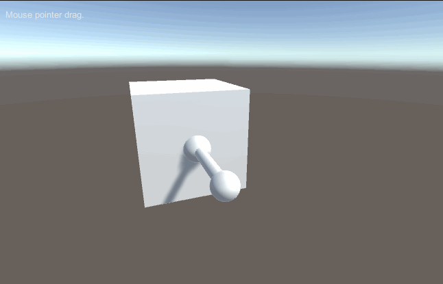

# MGS-Handle
- [中文手册](./README_ZH.md)

## Summary
- Unity plugin for make button switch, knob switch and rocker handle in scene.

## Environment
- Unity 5.0 or above.
- .Net Framework 3.0 or above.

## Scheme
- Control the Z axis displacement of button switch to show it down, lock and rebound effect.
- Control the Z axis angle of knob switch to show it rotate effect.
- Control the X and Y axis angle of rocker handle to show it rock around center effect.

## Achieve
- ButtonSwitch : Button switch, self lock switch.
- KnobSwitch : Knob switch.
- RockerHandle : Rocker handle.

## Demo
- Prefabs in the path "MGS-Handle/Prefabs" provide reference to you.
- Demos in the path "MGS-Handle/Scenes" provide reference to you.

## Preview
- ButtonSwitch

- KnobSwitch

- RockerHandle



## Contact
- If you have any questions, feel free to contact me at mogoson@qq.com.