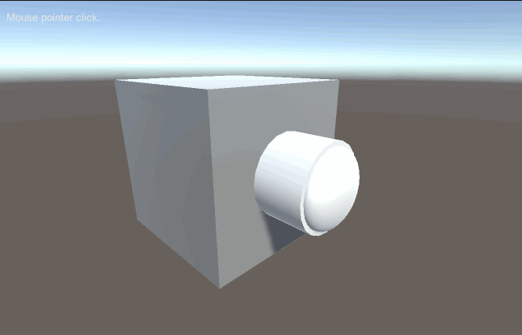
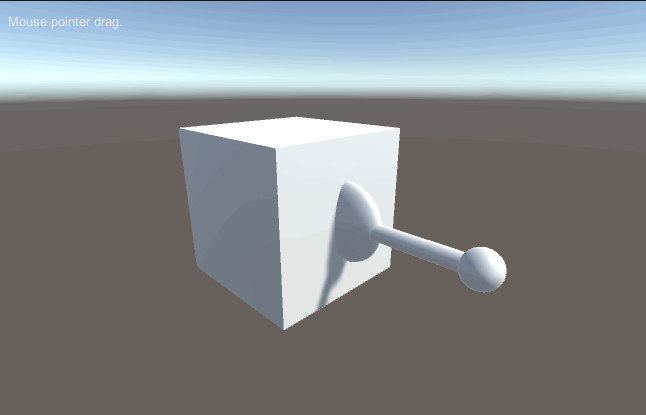
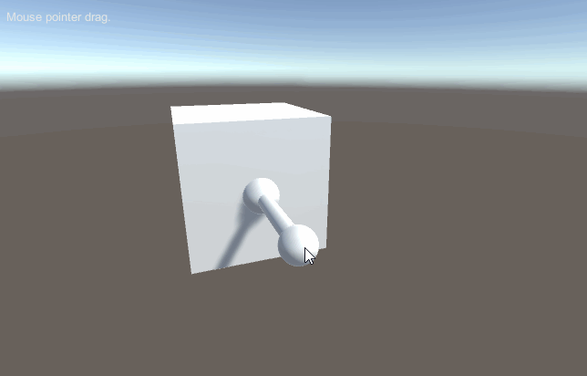

# MGS-Handle
- [English Manual](./README.md)

## 概述
- Unity制作按钮开关，旋钮开关，摇杆手柄插件包。

## 环境
- Unity 5.0 或更高版本。
- .Net Framework 3.0 或更高版本。

## 方案
- 控制按钮开关Z轴向位移表现其按下，自锁，回弹等效果。
- 控制旋钮开关Z轴向角度表现其旋转效果。
- 控制摇杆手柄X，Y两个轴向角度表现其绕中心轴摇摆效果。

## 实现
- ButtonSwitch：按钮开关，自锁按钮开关。
- KnobSwitch：旋钮开关。
- RockerHandle：摇杆手柄。
- SimpleLED：简单LED灯。

## 案例
- “MGS-Handle/Prefabs”目录下存有上述开关和手柄预制，供读者参考。
- “MGS-Handle/Scenes”目录下存有上述功能的演示案例，供读者参考。

## 预览
- Button Switch

- Knob Switch

- Rocker Handle



## 联系
- 如果你有任何问题或者建议，欢迎通过mogoson@outlook.com联系我。